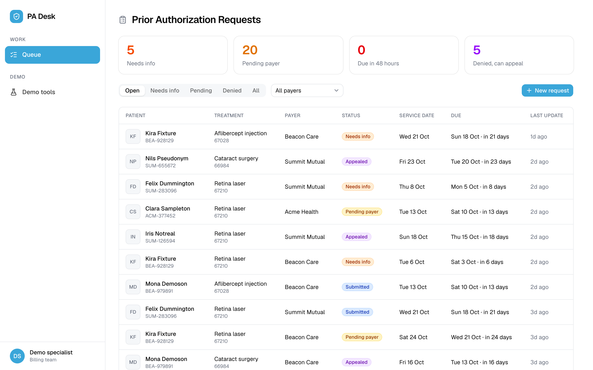
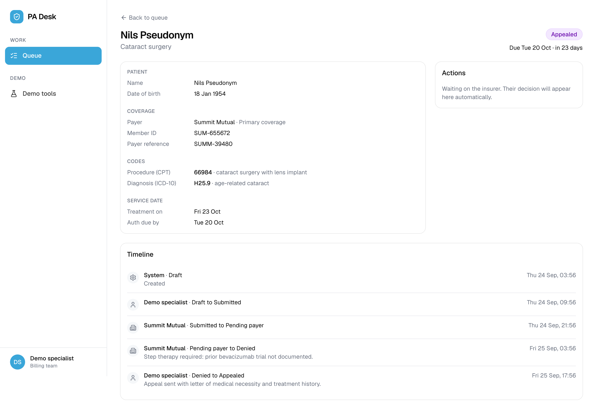
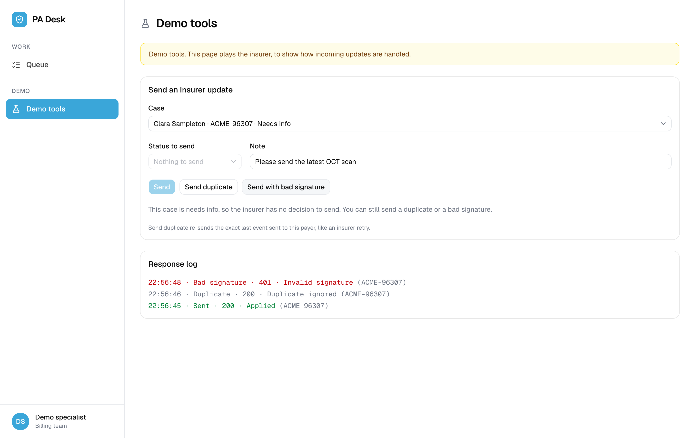
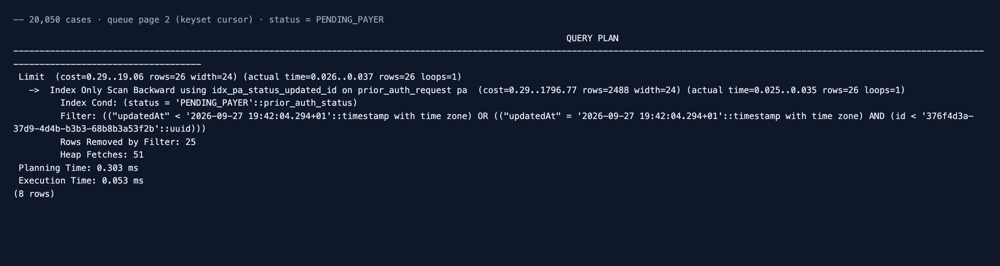

# PA Desk

A prior-authorization work queue for a specialty medical practice's billing team. Specialists see every open request sorted by what changed most recently, move cases through a strict status lifecycle, and receive signed status updates from insurers through a webhook that rejects forged messages and ignores duplicates.

**Portfolio project. All data is fake. Not affiliated with any company.**



---

## How to run it

You need **Node 22+** and **PostgreSQL 16** on `localhost:5432`, with user `padesk`, password `padesk` and database `padesk`.

```bash
# 1. Database: with Docker…
docker compose up -d
#    …or with a local Postgres 16:
#    createuser -s padesk && psql -d postgres -c "ALTER USER padesk PASSWORD 'padesk';" && createdb -O padesk padesk

# 2. API (NestJS) on :4000
cd api
cp .env.example .env
npm install
npm run migration:run
npm run seed           # 3 payers, 15 patients, 50 cases with full histories. Safe to re-run.
npm run start:dev

# 3. Web (Next.js) on :3000, in a second terminal
cd web
cp .env.example .env.local
npm install
npm run dev
```

- App: http://localhost:3000. Try **Demo tools** first: it plays the insurer.
- API docs (Swagger): http://localhost:4000/docs
- Tests: `cd api && npm test` (the status lifecycle rules)

---

## Screenshots

| A case and its audit timeline | Demo tools playing the insurer |
|---|---|
|  |  |

---

## Design decisions

**One `transition()` path, in a transaction with a row lock.** Every status change, from the UI or from an insurer's webhook, goes through `PriorAuthsService.transition()`. It locks the case row (`SELECT … FOR UPDATE`), checks the lifecycle rules, saves the new status and writes the audit event in **one transaction**, so the status and its history can never disagree. When two changes arrive at once, the second waits for the lock, re-reads the row and gets a 409. This was tested with simultaneous requests.

**The lifecycle lives in one file.** `api/src/modules/prior-auths/transitions.ts` defines which moves are allowed, which need a note, and **who** may make them. Approve, deny, pending and needs-info are the insurer's decisions: they only arrive through the webhook, and staff get a 403. The UI never decides this itself. It shows the `allowedActions` the API returns.

**An append-only event table as the audit trail.** `prior_auth_event` rows are only ever inserted. The table deliberately has no `updatedAt` or `version` column, and each case page renders its history as a timeline.

**An inbox table makes webhooks idempotent.** Insurers retry, so every delivery is recorded in `payer_webhook_event` under a unique index on `(payerId, externalEventId)`. A repeated delivery hits Postgres error `23505` and gets `200 duplicate_ignored`. This is atomic: two retries arriving together can't both get through, which a "check first, then insert" approach would allow. The index is **partial** (`WHERE "signatureValid" = true`), so a forged request can't claim a real event's ID and get the genuine one rejected as a duplicate.

**HMAC over the raw body, compared with `timingSafeEqual`.** The signature is checked on the exact bytes received (`rawBody: true`), because re-serialized JSON may not match the original. The idempotency key is the **signed** `eventId` in the body, not the unsigned `X-Event-Id` header, so a captured request can't be replayed under a new header. The body is only validated *after* the signature check.

**A composite index and keyset pagination.** The queue is newest-update-first, served by `idx_pa_status_updated_id (status, updatedAt, id)`, and pages with a cursor (the last row's `updatedAt|id`) rather than `OFFSET`. With 20,050 cases, fetching page 2 reads the index backwards and never sorts, in **0.05 ms**:



`updatedAt` is stored at millisecond precision because the cursor passes through a JavaScript `Date`. At microsecond precision it would never exactly match the stored value.

**Migrations, not `synchronize`.** Each generated migration was read before running, and three needed fixing by hand:
- The first created a shared enum type twice.
- The coverage migration would have **dropped every member ID** before copying it. It's rewritten as expand, copy, contract.
- One `down()` recreated an index with its columns reversed.

Each is tested up, down and up again, and checked for drift afterwards.

**Patients can have more than one insurance plan.** Member IDs belong to a coverage, not to the patient. A case bills one coverage, and the API rejects a coverage that belongs to a different patient.


### Architecture

- **API** (`api/`): NestJS 11, TypeORM, PostgreSQL. Each feature in `modules/<feature>` has its own controllers, services, repositories, entities and DTOs, and shared base classes live in `libs/core`. Responses are wrapped in `{ success, message, data }`.
- **Web** (`web/`): Next.js App Router with TanStack Query and axios.
  - One `services/<domain>/` folder per API area, holding the routes, calls, query hooks and types.
  - Forms use Formik + Yup, and the UI uses shadcn/Radix.
  - The queue, stats and case pages poll every 5 seconds, so insurer updates appear without a refresh.
- **Demo tools** (`/demo`) is a demo-only simulator. It signs updates with an insurer's secret, or a wrong one, and sends them to the real webhook over HTTP.

---
